# Database Schema Proposal

> This document proposes the detailed PostgreSQL schema for Anagrama, implementing the persistence architecture principles defined in PERSISTENCE_ARCHITECTURE.md.

## Entity Relationship Diagram

```mermaid
erDiagram
    %% Canonical Data
    users ||--o{ projects : creates
    users ||--o{ memories : creates
    users ||--o{ decisions : makes
    users ||--o{ tasks : creates
    users ||--o{ user_preferences : has

    projects ||--o{ sources : contains
    projects ||--o{ memories : contains
    projects ||--o{ tasks : contains
    projects ||--o{ decisions : relates_to

    sources ||--o{ source_files : has
    sources ||--o{ source_memory_links : appears_in
    sources ||--o{ embeddings : has
    sources ||--o{ summaries : has
    sources ||--o{ extracted_entities : contains
    sources ||--o{ extracted_concepts : contains

    memories ||--o{ memory_project_links : belongs_to
    memories ||--o{ embeddings : has
    memories ||--o{ memory_versions : has
    memories ||--o{ source_memory_links : references

    decisions ||--o{ decision_evidence_links : supported_by
    decisions ||--o{ provenance_records : has

    tasks ||--o{ task_state_history : has
    tasks ||--o{ provenance_records : has

    %% Derived Data
    embeddings ||--|| provenance_records : tracked_by
    summaries ||--|| provenance_records : tracked_by
    extracted_entities ||--|| provenance_records : tracked_by
    extracted_concepts ||--|| provenance_records : tracked_by
    classifications_auto ||--|| provenance_records : tracked_by

    %% Knowledge Graph
    knowledge_nodes ||--o{ knowledge_edges : source_of
    knowledge_nodes ||--o{ knowledge_edges : target_of
    knowledge_nodes ||--o{ embeddings : has
    knowledge_nodes ||--o{ extracted_entities : represents
    knowledge_nodes ||--o{ extracted_concepts : represents

    knowledge_edges ||--o{ provenance_records : tracked_by
    knowledge_edges ||--o{ edge_evidence_links : supported_by

    %% Skills
    skills ||--o{ skill_versions : has
    skills ||--o{ provenance_records : has

    users {
        uuid id PK
        string email
        string name
        timestamp created_at
        timestamp deleted_at
    }

    projects {
        uuid id PK
        uuid user_id FK
        string title
        text description
        timestamp created_at
        timestamp updated_at
        timestamp deleted_at
    }

    sources {
        uuid id PK
        uuid project_id FK
        string title
        string kind
        text content
        jsonb metadata
        timestamp created_at
        timestamp deleted_at
    }

    source_files {
        uuid id PK
        uuid source_id FK
        string filename
        string storage_path
        string mime_type
        bigint size_bytes
        timestamp created_at
    }

    memories {
        uuid id PK
        uuid user_id FK
        uuid project_id FK
        string tier
        text content
        float importance_score
        timestamp created_at
        timestamp updated_at
        timestamp deleted_at
    }

    memory_versions {
        uuid id PK
        uuid memory_id FK
        text content
        string change_reason
        uuid changed_by FK
        timestamp created_at
    }

    decisions {
        uuid id PK
        uuid user_id FK
        uuid project_id FK
        text content
        text context
        jsonb alternatives
        uuid chosen_alternative
        text rationale
        text impact
        timestamp created_at
        timestamp deleted_at
    }

    tasks {
        uuid id PK
        uuid user_id FK
        uuid project_id FK
        text contract
        jsonb scope
        string status
        float progress
        jsonb result
        timestamp created_at
        timestamp updated_at
        timestamp deleted_at
    }

    task_state_history {
        uuid id PK
        uuid task_id FK
        string status
        float progress
        jsonb state_data
        timestamp created_at
    }

    user_preferences {
        uuid id PK
        uuid user_id FK
        string preference_key
        jsonb preference_value
        timestamp created_at
        timestamp updated_at
    }

    embeddings {
        uuid id PK
        uuid entity_id FK
        string entity_type
        vector vector
        string model_used
        string model_version
        timestamp generated_at
        float confidence
        timestamp deleted_at
    }

    summaries {
        uuid id PK
        uuid source_id FK
        text summary_content
        string summary_type
        string model_used
        string model_version
        timestamp generated_at
        float confidence
        timestamp deleted_at
    }

    extracted_entities {
        uuid id PK
        uuid source_id FK
        string entity_text
        string entity_type
        jsonb entity_metadata
        string extraction_method
        string model_used
        float confidence
        timestamp extracted_at
        timestamp deleted_at
    }

    extracted_concepts {
        uuid id PK
        uuid source_id FK
        string concept_text
        jsonb concept_metadata
        string extraction_method
        string model_used
        float confidence
        timestamp extracted_at
        timestamp deleted_at
    }

    classifications_auto {
        uuid id PK
        uuid entity_id FK
        string entity_type
        string classification
        string model_used
        float confidence
        timestamp classified_at
        timestamp deleted_at
    }

    knowledge_nodes {
        uuid id PK
        string label
        string node_type
        float confidence
        jsonb metadata
        timestamp created_at
        timestamp updated_at
        timestamp deleted_at
    }

    knowledge_edges {
        uuid id PK
        uuid source_node_id FK
        uuid target_node_id FK
        string relation
        float confidence
        jsonb metadata
        timestamp created_at
        timestamp updated_at
        timestamp deleted_at
    }

    edge_evidence_links {
        uuid id PK
        uuid edge_id FK
        uuid source_id FK
        timestamp created_at
    }

    source_memory_links {
        uuid id PK
        uuid source_id FK
        uuid memory_id FK
        string link_type
        timestamp created_at
    }

    memory_project_links {
        uuid id PK
        uuid memory_id FK
        uuid project_id FK
        timestamp created_at
    }

    decision_evidence_links {
        uuid id PK
        uuid decision_id FK
        uuid source_id FK
        timestamp created_at
    }

    provenance_records {
        uuid id PK
        uuid derived_record_id FK
        string derived_record_type
        uuid origin_record_id FK
        string origin_record_type
        string generation_method
        string model_used
        string model_version
        jsonb parameters
        timestamp generated_at
        float confidence
        uuid[] chain_of_custody
    }

    skills {
        uuid id PK
        string name
        text description
        jsonb procedure
        timestamp created_at
        timestamp updated_at
        timestamp deleted_at
    }

    skill_versions {
        uuid id PK
        uuid skill_id FK
        jsonb procedure
        string version_description
        timestamp created_at
    }
```



## Table Definitions

### Core Tables (Canonical Data)

#### users
**Purpose:** User accounts and authentication (single-user-first but future multi-user compatible)

**Classification:** Canonical

**Primary Key:** UUID (id)

**Important Fields:**
- `id` UUID - Unique user identifier
- `email` VARCHAR(255) - User email (unique)
- `name` VARCHAR(255) - Display name
- `created_at` TIMESTAMP - Account creation time
- `deleted_at` TIMESTAMP - Soft delete timestamp

**Foreign Keys:** None

**Mutability:** Email and name mutable, created_at immutable, deleted_at set once

**Retention:** Permanent retention (audit trail)

**Indexes:**
- PRIMARY KEY on `id`
- UNIQUE INDEX on `email`
- INDEX on `deleted_at` for filtering active users

```sql
CREATE TABLE users (
    id UUID PRIMARY KEY DEFAULT gen_random_uuid(),
    email VARCHAR(255) UNIQUE NOT NULL,
    name VARCHAR(255) NOT NULL,
    created_at TIMESTAMP NOT NULL DEFAULT NOW(),
    deleted_at TIMESTAMP
);

CREATE INDEX idx_users_email ON users(email);
CREATE INDEX idx_users_deleted_at ON users(deleted_at);
```

#### projects
**Purpose:** Project definitions and organizational containers

**Classification:** Canonical

**Primary Key:** UUID (id)

**Important Fields:**
- `id` UUID - Unique project identifier
- `user_id` UUID - Foreign key to users
- `title` VARCHAR(500) - Project title
- `description` TEXT - Project description
- `created_at` TIMESTAMP - Creation time
- `updated_at` TIMESTAMP - Last update time
- `deleted_at` TIMESTAMP - Soft delete timestamp

**Foreign Keys:**
- `user_id` → users(id)

**Mutability:** Title, description, updated_at mutable; created_at immutable; deleted_at set once

**Retention:** Retain until explicitly deleted by user

**Indexes:**
- PRIMARY KEY on `id`
- INDEX on `user_id` for user's projects
- INDEX on `deleted_at` for filtering active projects
- INDEX on `created_at` for temporal queries

```sql
CREATE TABLE projects (
    id UUID PRIMARY KEY DEFAULT gen_random_uuid(),
    user_id UUID NOT NULL REFERENCES users(id),
    title VARCHAR(500) NOT NULL,
    description TEXT,
    created_at TIMESTAMP NOT NULL DEFAULT NOW(),
    updated_at TIMESTAMP NOT NULL DEFAULT NOW(),
    deleted_at TIMESTAMP
);

CREATE INDEX idx_projects_user_id ON projects(user_id);
CREATE INDEX idx_projects_deleted_at ON projects(deleted_at);
CREATE INDEX idx_projects_created_at ON projects(created_at);
```

#### sources
**Purpose:** Original content sources (documents, files, web content, etc.)

**Classification:** Canonical

**Primary Key:** UUID (id)

**Important Fields:**
- `id` UUID - Unique source identifier
- `project_id` UUID - Foreign key to projects
- `title` VARCHAR(1000) - Source title
- `kind` VARCHAR(100) - Source type (document, note, file, web, etc.)
- `content` TEXT - Full source content
- `metadata` JSONB - Flexible metadata (author, URL, tags, etc.)
- `created_at` TIMESTAMP - Creation time
- `deleted_at` TIMESTAMP - Soft delete timestamp

**Foreign Keys:**
- `project_id` → projects(id)

**Mutability:** Immutable once created (soft delete only)

**Retention:** Permanent retention (never auto-delete)

**Indexes:**
- PRIMARY KEY on `id`
- INDEX on `project_id` for project sources
- INDEX on `kind` for type filtering
- INDEX on `created_at` for temporal queries
- INDEX on `deleted_at` for filtering active sources
- GIN INDEX on `metadata` for JSONB queries

```sql
CREATE TABLE sources (
    id UUID PRIMARY KEY DEFAULT gen_random_uuid(),
    project_id UUID NOT NULL REFERENCES projects(id),
    title VARCHAR(1000) NOT NULL,
    kind VARCHAR(100) NOT NULL,
    content TEXT,
    metadata JSONB DEFAULT '{}',
    created_at TIMESTAMP NOT NULL DEFAULT NOW(),
    deleted_at TIMESTAMP
);

CREATE INDEX idx_sources_project_id ON sources(project_id);
CREATE INDEX idx_sources_kind ON sources(kind);
CREATE INDEX idx_sources_created_at ON sources(created_at);
CREATE INDEX idx_sources_deleted_at ON sources(deleted_at);
CREATE INDEX idx_sources_metadata ON sources USING GIN(metadata);
```

#### source_files
**Purpose:** References to uploaded files (separate from source content for large files)

**Classification:** Canonical

**Primary Key:** UUID (id)

**Important Fields:**
- `id` UUID - Unique file identifier
- `source_id` UUID - Foreign key to sources
- `filename` VARCHAR(500) - Original filename
- `storage_path` VARCHAR(1000) - Path to stored file
- `mime_type` VARCHAR(100) - File MIME type
- `size_bytes` BIGINT - File size in bytes
- `created_at` TIMESTAMP - Upload time

**Foreign Keys:**
- `source_id` → sources(id)

**Mutability:** Immutable once created

**Retention:** Permanent retention (never auto-delete)

**Indexes:**
- PRIMARY KEY on `id`
- INDEX on `source_id` for source's files
- INDEX on `storage_path` for file lookup

```sql
CREATE TABLE source_files (
    id UUID PRIMARY KEY DEFAULT gen_random_uuid(),
    source_id UUID NOT NULL REFERENCES sources(id),
    filename VARCHAR(500) NOT NULL,
    storage_path VARCHAR(1000) NOT NULL,
    mime_type VARCHAR(100),
    size_bytes BIGINT,
    created_at TIMESTAMP NOT NULL DEFAULT NOW()
);

CREATE INDEX idx_source_files_source_id ON source_files(source_id);
CREATE INDEX idx_source_files_storage_path ON source_files(storage_path);
```

#### memories
**Purpose:** User-created memories with tiered organization

**Classification:** Canonical (versioned)

**Primary Key:** UUID (id)

**Important Fields:**
- `id` UUID - Unique memory identifier
- `user_id` UUID - Foreign key to users
- `project_id` UUID - Foreign key to projects (nullable)
- `tier` VARCHAR(50) - Memory tier (working, conversation, project, knowledge, personal)
- `content` TEXT - Memory content
- `importance_score` FLOAT - User/system assigned importance (0-1)
- `created_at` TIMESTAMP - Creation time
- `updated_at` TIMESTAMP - Last update time
- `deleted_at` TIMESTAMP - Soft delete timestamp

**Foreign Keys:**
- `user_id` → users(id)
- `project_id` → projects(id)

**Mutability:** Content, importance_score, updated_at mutable; created_at immutable; deleted_at set once

**Retention:** Long-term retention with user-controlled deletion

**Indexes:**
- PRIMARY KEY on `id`
- INDEX on `user_id` for user's memories
- INDEX on `project_id` for project memories
- INDEX on `tier` for tier filtering
- INDEX on `importance_score` for importance-based retrieval
- INDEX on `created_at` for temporal queries
- INDEX on `deleted_at` for filtering active memories
- Composite INDEX on (project_id, importance_score, created_at) for common retrieval

```sql
CREATE TABLE memories (
    id UUID PRIMARY KEY DEFAULT gen_random_uuid(),
    user_id UUID NOT NULL REFERENCES users(id),
    project_id UUID REFERENCES projects(id),
    tier VARCHAR(50) NOT NULL,
    content TEXT NOT NULL,
    importance_score FLOAT DEFAULT 0.5,
    created_at TIMESTAMP NOT NULL DEFAULT NOW(),
    updated_at TIMESTAMP NOT NULL DEFAULT NOW(),
    deleted_at TIMESTAMP
);

CREATE INDEX idx_memories_user_id ON memories(user_id);
CREATE INDEX idx_memories_project_id ON memories(project_id);
CREATE INDEX idx_memories_tier ON memories(tier);
CREATE INDEX idx_memories_importance_score ON memories(importance_score);
CREATE INDEX idx_memories_created_at ON memories(created_at);
CREATE INDEX idx_memories_deleted_at ON memories(deleted_at);
CREATE INDEX idx_memories_retrieval ON memories(project_id, importance_score, created_at DESC);
```

#### memory_versions
**Purpose:** Version history for memory edits

**Classification:** Canonical (version history)

**Primary Key:** UUID (id)

**Important Fields:**
- `id` UUID - Unique version identifier
- `memory_id` UUID - Foreign key to memories
- `content` TEXT - Memory content at this version
- `change_reason` TEXT - Reason for change
- `changed_by` UUID - Foreign key to users
- `created_at` TIMESTAMP - Version creation time

**Foreign Keys:**
- `memory_id` → memories(id)
- `changed_by` → users(id)

**Mutability:** Immutable once created

**Retention:** Permanent retention (audit trail)

**Indexes:**
- PRIMARY KEY on `id`
- INDEX on `memory_id` for memory's versions
- INDEX on `created_at` for temporal version queries

```sql
CREATE TABLE memory_versions (
    id UUID PRIMARY KEY DEFAULT gen_random_uuid(),
    memory_id UUID NOT NULL REFERENCES memories(id),
    content TEXT NOT NULL,
    change_reason TEXT,
    changed_by UUID REFERENCES users(id),
    created_at TIMESTAMP NOT NULL DEFAULT NOW()
);

CREATE INDEX idx_memory_versions_memory_id ON memory_versions(memory_id);
CREATE INDEX idx_memory_versions_created_at ON memory_versions(created_at);
```

#### decisions
**Purpose:** User decisions with rationale and evidence

**Classification:** Canonical

**Primary Key:** UUID (id)

**Important Fields:**
- `id` UUID - Unique decision identifier
- `user_id` UUID - Foreign key to users
- `project_id` UUID - Foreign key to projects
- `content` TEXT - Decision content
- `context` TEXT - Decision context
- `alternatives` JSONB - Alternative options considered
- `chosen_alternative` UUID - ID of chosen alternative
- `rationale` TEXT - Decision rationale
- `impact` TEXT - Expected impact
- `created_at` TIMESTAMP - Decision time
- `deleted_at` TIMESTAMP - Soft delete timestamp

**Foreign Keys:**
- `user_id` → users(id)
- `project_id` → projects(id)

**Mutability:** Immutable once created (create new to change)

**Retention:** Permanent retention (audit trail)

**Indexes:**
- PRIMARY KEY on `id`
- INDEX on `user_id` for user's decisions
- INDEX on `project_id` for project decisions
- INDEX on `created_at` for temporal queries
- INDEX on `deleted_at` for filtering active decisions

```sql
CREATE TABLE decisions (
    id UUID PRIMARY KEY DEFAULT gen_random_uuid(),
    user_id UUID NOT NULL REFERENCES users(id),
    project_id UUID REFERENCES projects(id),
    content TEXT NOT NULL,
    context TEXT,
    alternatives JSONB DEFAULT '[]',
    chosen_alternative UUID,
    rationale TEXT,
    impact TEXT,
    created_at TIMESTAMP NOT NULL DEFAULT NOW(),
    deleted_at TIMESTAMP
);

CREATE INDEX idx_decisions_user_id ON decisions(user_id);
CREATE INDEX idx_decisions_project_id ON decisions(project_id);
CREATE INDEX idx_decisions_created_at ON decisions(created_at);
CREATE INDEX idx_decisions_deleted_at ON decisions(deleted_at);
```

#### tasks
**Purpose:** User-defined tasks with contracts and state tracking

**Classification:** Canonical

**Primary Key:** UUID (id)

**Important Fields:**
- `id` UUID - Unique task identifier
- `user_id` UUID - Foreign key to users
- `project_id` UUID - Foreign key to projects
- `contract` TEXT - Task contract (scope, objectives, success criteria)
- `scope` JSONB - Task scope definition
- `status` VARCHAR(50) - Task status (pending, in_progress, completed, failed)
- `progress` FLOAT - Task progress (0-1)
- `result` JSONB - Task result
- `created_at` TIMESTAMP - Creation time
- `updated_at` TIMESTAMP - Last update time
- `deleted_at` TIMESTAMP - Soft delete timestamp

**Foreign Keys:**
- `user_id` → users(id)
- `project_id` → projects(id)

**Mutability:** Status, progress, result, updated_at mutable; contract, scope mutable but versioned; created_at immutable; deleted_at set once

**Retention:** Retain based on project policy or user preference

**Indexes:**
- PRIMARY KEY on `id`
- INDEX on `user_id` for user's tasks
- INDEX on `project_id` for project tasks
- INDEX on `status` for status filtering
- INDEX on `created_at` for temporal queries
- INDEX on `deleted_at` for filtering active tasks

```sql
CREATE TABLE tasks (
    id UUID PRIMARY KEY DEFAULT gen_random_uuid(),
    user_id UUID NOT NULL REFERENCES users(id),
    project_id UUID REFERENCES projects(id),
    contract TEXT NOT NULL,
    scope JSONB DEFAULT '{}',
    status VARCHAR(50) NOT NULL DEFAULT 'pending',
    progress FLOAT DEFAULT 0.0,
    result JSONB,
    created_at TIMESTAMP NOT NULL DEFAULT NOW(),
    updated_at TIMESTAMP NOT NULL DEFAULT NOW(),
    deleted_at TIMESTAMP
);

CREATE INDEX idx_tasks_user_id ON tasks(user_id);
CREATE INDEX idx_tasks_project_id ON tasks(project_id);
CREATE INDEX idx_tasks_status ON tasks(status);
CREATE INDEX idx_tasks_created_at ON tasks(created_at);
CREATE INDEX idx_tasks_deleted_at ON tasks(deleted_at);
```

#### task_state_history
**Purpose:** History of task state changes

**Classification:** Canonical (audit trail)

**Primary Key:** UUID (id)

**Important Fields:**
- `id` UUID - Unique state record identifier
- `task_id` UUID - Foreign key to tasks
- `status` VARCHAR(50) - Task status at this point
- `progress` FLOAT - Task progress at this point
- `state_data` JSONB - Additional state information
- `created_at` TIMESTAMP - State change time

**Foreign Keys:**
- `task_id` → tasks(id)

**Mutability:** Immutable once created

**Retention:** Permanent retention (audit trail)

**Indexes:**
- PRIMARY KEY on `id`
- INDEX on `task_id` for task's state history
- INDEX on `created_at` for temporal state queries

```sql
CREATE TABLE task_state_history (
    id UUID PRIMARY KEY DEFAULT gen_random_uuid(),
    task_id UUID NOT NULL REFERENCES tasks(id),
    status VARCHAR(50) NOT NULL,
    progress FLOAT NOT NULL,
    state_data JSONB DEFAULT '{}',
    created_at TIMESTAMP NOT NULL DEFAULT NOW()
);

CREATE INDEX idx_task_state_history_task_id ON task_state_history(task_id);
CREATE INDEX idx_task_state_history_created_at ON task_state_history(created_at);
```

#### user_preferences
**Purpose:** User preferences and settings

**Classification:** Canonical

**Primary Key:** UUID (id)

**Important Fields:**
- `id` UUID - Unique preference identifier
- `user_id` UUID - Foreign key to users
- `preference_key` VARCHAR(100) - Preference key
- `preference_value` JSONB - Preference value (flexible type)
- `created_at` TIMESTAMP - Creation time
- `updated_at` TIMESTAMP - Last update time

**Foreign Keys:**
- `user_id` → users(id)

**Mutability:** preference_value, updated_at mutable; created_at immutable

**Retention:** Permanent retention

**Indexes:**
- PRIMARY KEY on `id`
- UNIQUE INDEX on (user_id, preference_key) for user's preferences
- INDEX on `preference_key` for preference lookups

```sql
CREATE TABLE user_preferences (
    id UUID PRIMARY KEY DEFAULT gen_random_uuid(),
    user_id UUID NOT NULL REFERENCES users(id),
    preference_key VARCHAR(100) NOT NULL,
    preference_value JSONB NOT NULL,
    created_at TIMESTAMP NOT NULL DEFAULT NOW(),
    updated_at TIMESTAMP NOT NULL DEFAULT NOW()
);

CREATE UNIQUE INDEX idx_user_preferences_user_key ON user_preferences(user_id, preference_key);
CREATE INDEX idx_user_preferences_key ON user_preferences(preference_key);
```

### Derived Data Tables

#### embeddings
**Purpose:** Vector embeddings for semantic search

**Classification:** Derived

**Primary Key:** UUID (id)

**Important Fields:**
- `id` UUID - Unique embedding identifier
- `entity_id` UUID - ID of the entity this embedding represents
- `entity_type` VARCHAR(50) - Type of entity (source, memory, node, etc.)
- `vector` VECTOR(1536) - Vector embedding (OpenAI ada-002 dimension)
- `model_used` VARCHAR(100) - Model used for embedding
- `model_version` VARCHAR(50) - Model version
- `generated_at` TIMESTAMP - Generation time
- `confidence` FLOAT - Confidence in embedding quality
- `deleted_at` TIMESTAMP - Soft delete timestamp

**Foreign Keys:** None (entity_id is logical reference, not enforced FK)

**Mutability:** Regenerable from canonical data

**Retention:** Can be regenerated (shorter retention acceptable)

**Indexes:**
- PRIMARY KEY on `id`
- INDEX on `entity_id` for entity's embeddings
- INDEX on `entity_type` for type filtering
- INDEX on `deleted_at` for filtering active embeddings
- HNSW INDEX on `vector` for semantic search (pgvector)

```sql
CREATE EXTENSION IF NOT EXISTS vector;

CREATE TABLE embeddings (
    id UUID PRIMARY KEY DEFAULT gen_random_uuid(),
    entity_id UUID NOT NULL,
    entity_type VARCHAR(50) NOT NULL,
    vector VECTOR(1536) NOT NULL,
    model_used VARCHAR(100) NOT NULL,
    model_version VARCHAR(50),
    generated_at TIMESTAMP NOT NULL DEFAULT NOW(),
    confidence FLOAT,
    deleted_at TIMESTAMP
);

CREATE INDEX idx_embeddings_entity_id ON embeddings(entity_id);
CREATE INDEX idx_embeddings_entity_type ON embeddings(entity_type);
CREATE INDEX idx_embeddings_deleted_at ON embeddings(deleted_at);
CREATE INDEX idx_embeddings_vector ON embeddings USING hnsw(vector vector_cosine_ops);
```

#### summaries
**Purpose:** AI-generated summaries of sources

**Classification:** Derived

**Primary Key:** UUID (id)

**Important Fields:**
- `id` UUID - Unique summary identifier
- `source_id` UUID - Foreign key to sources
- `summary_content` TEXT - Summary text
- `summary_type` VARCHAR(50) - Type of summary (brief, detailed, bullet_points, etc.)
- `model_used` VARCHAR(100) - Model used for summarization
- `model_version` VARCHAR(50) - Model version
- `generated_at` TIMESTAMP - Generation time
- `confidence` FLOAT - Confidence in summary quality
- `deleted_at` TIMESTAMP - Soft delete timestamp

**Foreign Keys:**
- `source_id` → sources(id)

**Mutability:** Regenerable from source content

**Retention:** Can be regenerated (shorter retention acceptable)

**Indexes:**
- PRIMARY KEY on `id`
- INDEX on `source_id` for source's summaries
- INDEX on `summary_type` for type filtering
- INDEX on `deleted_at` for filtering active summaries

```sql
CREATE TABLE summaries (
    id UUID PRIMARY KEY DEFAULT gen_random_uuid(),
    source_id UUID NOT NULL REFERENCES sources(id),
    summary_content TEXT NOT NULL,
    summary_type VARCHAR(50) NOT NULL,
    model_used VARCHAR(100) NOT NULL,
    model_version VARCHAR(50),
    generated_at TIMESTAMP NOT NULL DEFAULT NOW(),
    confidence FLOAT,
    deleted_at TIMESTAMP
);

CREATE INDEX idx_summaries_source_id ON summaries(source_id);
CREATE INDEX idx_summaries_summary_type ON summaries(summary_type);
CREATE INDEX idx_summaries_deleted_at ON summaries(deleted_at);
```

#### extracted_entities
**Purpose:** Named entities extracted from sources

**Classification:** Derived

**Primary Key:** UUID (id)

**Important Fields:**
- `id` UUID - Unique entity extraction identifier
- `source_id` UUID - Foreign key to sources
- `entity_text` VARCHAR(500) - Extracted entity text
- `entity_type` VARCHAR(100) - Entity type (PERSON, ORG, LOCATION, etc.)
- `entity_metadata` JSONB - Additional entity metadata
- `extraction_method` VARCHAR(100) - Extraction method
- `model_used` VARCHAR(100) - Model used for extraction
- `confidence` FLOAT - Confidence in extraction
- `extracted_at` TIMESTAMP - Extraction time
- `deleted_at` TIMESTAMP - Soft delete timestamp

**Foreign Keys:**
- `source_id` → sources(id)

**Mutability:** Regenerable from source content

**Retention:** Can be regenerated (shorter retention acceptable)

**Indexes:**
- PRIMARY KEY on `id`
- INDEX on `source_id` for source's entities
- INDEX on `entity_type` for type filtering
- INDEX on `entity_text` for text search
- INDEX on `deleted_at` for filtering active entities
- GIN INDEX on `entity_metadata` for JSONB queries

```sql
CREATE TABLE extracted_entities (
    id UUID PRIMARY KEY DEFAULT gen_random_uuid(),
    source_id UUID NOT NULL REFERENCES sources(id),
    entity_text VARCHAR(500) NOT NULL,
    entity_type VARCHAR(100) NOT NULL,
    entity_metadata JSONB DEFAULT '{}',
    extraction_method VARCHAR(100) NOT NULL,
    model_used VARCHAR(100),
    confidence FLOAT,
    extracted_at TIMESTAMP NOT NULL DEFAULT NOW(),
    deleted_at TIMESTAMP
);

CREATE INDEX idx_extracted_entities_source_id ON extracted_entities(source_id);
CREATE INDEX idx_extracted_entities_entity_type ON extracted_entities(entity_type);
CREATE INDEX idx_extracted_entities_entity_text ON extracted_entities(entity_text);
CREATE INDEX idx_extracted_entities_deleted_at ON extracted_entities(deleted_at);
CREATE INDEX idx_extracted_entities_metadata ON extracted_entities USING GIN(entity_metadata);
```

#### extracted_concepts
**Purpose:** Concepts extracted from sources

**Classification:** Derived

**Primary Key:** UUID (id)

**Important Fields:**
- `id` UUID - Unique concept extraction identifier
- `source_id` UUID - Foreign key to sources
- `concept_text` VARCHAR(500) - Extracted concept text
- `concept_metadata` JSONB - Additional concept metadata
- `extraction_method` VARCHAR(100) - Extraction method
- `model_used` VARCHAR(100) - Model used for extraction
- `confidence` FLOAT - Confidence in extraction
- `extracted_at` TIMESTAMP - Extraction time
- `deleted_at` TIMESTAMP - Soft delete timestamp

**Foreign Keys:**
- `source_id` → sources(id)

**Mutability:** Regenerable from source content

**Retention:** Can be regenerated (shorter retention acceptable)

**Indexes:**
- PRIMARY KEY on `id`
- INDEX on `source_id` for source's concepts
- INDEX on `concept_text` for text search
- INDEX on `deleted_at` for filtering active concepts
- GIN INDEX on `concept_metadata` for JSONB queries

```sql
CREATE TABLE extracted_concepts (
    id UUID PRIMARY KEY DEFAULT gen_random_uuid(),
    source_id UUID NOT NULL REFERENCES sources(id),
    concept_text VARCHAR(500) NOT NULL,
    concept_metadata JSONB DEFAULT '{}',
    extraction_method VARCHAR(100) NOT NULL,
    model_used VARCHAR(100),
    confidence FLOAT,
    extracted_at TIMESTAMP NOT NULL DEFAULT NOW(),
    deleted_at TIMESTAMP
);

CREATE INDEX idx_extracted_concepts_source_id ON extracted_concepts(source_id);
CREATE INDEX idx_extracted_concepts_concept_text ON extracted_concepts(concept_text);
CREATE INDEX idx_extracted_concepts_deleted_at ON extracted_concepts(deleted_at);
CREATE INDEX idx_extracted_concepts_metadata ON extracted_concepts USING GIN(concept_metadata);
```

#### classifications_auto
**Purpose:** Automatic classifications of entities

**Classification:** Derived

**Primary Key:** UUID (id)

**Important Fields:**
- `id` UUID - Unique classification identifier
- `entity_id` UUID - ID of the entity being classified
- `entity_type` VARCHAR(50) - Type of entity being classified
- `classification` VARCHAR(100) - Classification label
- `model_used` VARCHAR(100) - Model used for classification
- `confidence` FLOAT - Confidence in classification
- `classified_at` TIMESTAMP - Classification time
- `deleted_at` TIMESTAMP - Soft delete timestamp

**Foreign Keys:** None (entity_id is logical reference)

**Mutability:** Regenerable from entity data

**Retention:** Can be regenerated (shorter retention acceptable)

**Indexes:**
- PRIMARY KEY on `id`
- INDEX on `entity_id` for entity's classifications
- INDEX on `entity_type` for type filtering
- INDEX on `classification` for classification lookup
- INDEX on `deleted_at` for filtering active classifications

```sql
CREATE TABLE classifications_auto (
    id UUID PRIMARY KEY DEFAULT gen_random_uuid(),
    entity_id UUID NOT NULL,
    entity_type VARCHAR(50) NOT NULL,
    classification VARCHAR(100) NOT NULL,
    model_used VARCHAR(100) NOT NULL,
    confidence FLOAT,
    classified_at TIMESTAMP NOT NULL DEFAULT NOW(),
    deleted_at TIMESTAMP
);

CREATE INDEX idx_classifications_auto_entity_id ON classifications_auto(entity_id);
CREATE INDEX idx_classifications_auto_entity_type ON classifications_auto(entity_type);
CREATE INDEX idx_classifications_auto_classification ON classifications_auto(classification);
CREATE INDEX idx_classifications_auto_deleted_at ON classifications_auto(deleted_at);
```

### Knowledge Graph Tables

#### knowledge_nodes
**Purpose:** Knowledge graph nodes (concepts, entities, documents, etc.)

**Classification:** Canonical (user-created) or Derived (system-extracted)

**Primary Key:** UUID (id)

**Important Fields:**
- `id` UUID - Unique node identifier
- `label` VARCHAR(500) - Node label/text
- `node_type` VARCHAR(100) - Node type (concept, entity, document, project, etc.)
- `confidence` FLOAT - Confidence in node validity
- `metadata` JSONB - Additional node metadata
- `created_at` TIMESTAMP - Creation time
- `updated_at` TIMESTAMP - Last update time
- `deleted_at` TIMESTAMP - Soft delete timestamp

**Foreign Keys:** None

**Mutability:** Label, confidence, metadata, updated_at mutable; created_at immutable; deleted_at set once

**Retention:** Long-term retention

**Indexes:**
- PRIMARY KEY on `id`
- INDEX on `node_type` for type filtering
- INDEX on `label` for text search
- INDEX on `confidence` for confidence-based queries
- INDEX on `created_at` for temporal queries
- INDEX on `deleted_at` for filtering active nodes
- GIN INDEX on `metadata` for JSONB queries

```sql
CREATE TABLE knowledge_nodes (
    id UUID PRIMARY KEY DEFAULT gen_random_uuid(),
    label VARCHAR(500) NOT NULL,
    node_type VARCHAR(100) NOT NULL,
    confidence FLOAT DEFAULT 0.7,
    metadata JSONB DEFAULT '{}',
    created_at TIMESTAMP NOT NULL DEFAULT NOW(),
    updated_at TIMESTAMP NOT NULL DEFAULT NOW(),
    deleted_at TIMESTAMP
);

CREATE INDEX idx_knowledge_nodes_node_type ON knowledge_nodes(node_type);
CREATE INDEX idx_knowledge_nodes_label ON knowledge_nodes(label);
CREATE INDEX idx_knowledge_nodes_confidence ON knowledge_nodes(confidence);
CREATE INDEX idx_knowledge_nodes_created_at ON knowledge_nodes(created_at);
CREATE INDEX idx_knowledge_nodes_deleted_at ON knowledge_nodes(deleted_at);
CREATE INDEX idx_knowledge_nodes_metadata ON knowledge_nodes USING GIN(metadata);
```

#### knowledge_edges
**Purpose:** Knowledge graph relationships between nodes

**Classification:** Canonical (user-created) or Derived (system-inferred)

**Primary Key:** UUID (id)

**Important Fields:**
- `id` UUID - Unique edge identifier
- `source_node_id` UUID - Foreign key to knowledge_nodes (source)
- `target_node_id` UUID - Foreign key to knowledge_nodes (target)
- `relation` VARCHAR(100) - Relationship type
- `confidence` FLOAT - Confidence in relationship validity
- `metadata` JSONB - Additional edge metadata
- `created_at` TIMESTAMP - Creation time
- `updated_at` TIMESTAMP - Last update time
- `deleted_at` TIMESTAMP - Soft delete timestamp

**Foreign Keys:**
- `source_node_id` → knowledge_nodes(id)
- `target_node_id` → knowledge_nodes(id)

**Mutability:** Confidence, metadata, updated_at mutable; created_at immutable; deleted_at set once

**Retention:** Long-term retention

**Indexes:**
- PRIMARY KEY on `id`
- INDEX on `source_node_id` for outgoing edges
- INDEX on `target_node_id` for incoming edges
- INDEX on `relation` for relationship type filtering
- INDEX on `confidence` for confidence-based queries
- INDEX on `created_at` for temporal queries
- INDEX on `deleted_at` for filtering active edges
- GIN INDEX on `metadata` for JSONB queries

```sql
CREATE TABLE knowledge_edges (
    id UUID PRIMARY KEY DEFAULT gen_random_uuid(),
    source_node_id UUID NOT NULL REFERENCES knowledge_nodes(id),
    target_node_id UUID NOT NULL REFERENCES knowledge_nodes(id),
    relation VARCHAR(100) NOT NULL,
    confidence FLOAT DEFAULT 0.65,
    metadata JSONB DEFAULT '{}',
    created_at TIMESTAMP NOT NULL DEFAULT NOW(),
    updated_at TIMESTAMP NOT NULL DEFAULT NOW(),
    deleted_at TIMESTAMP
);

CREATE INDEX idx_knowledge_edges_source_node_id ON knowledge_edges(source_node_id);
CREATE INDEX idx_knowledge_edges_target_node_id ON knowledge_edges(target_node_id);
CREATE INDEX idx_knowledge_edges_relation ON knowledge_edges(relation);
CREATE INDEX idx_knowledge_edges_confidence ON knowledge_edges(confidence);
CREATE INDEX idx_knowledge_edges_created_at ON knowledge_edges(created_at);
CREATE INDEX idx_knowledge_edges_deleted_at ON knowledge_edges(deleted_at);
CREATE INDEX idx_knowledge_edges_metadata ON knowledge_edges USING GIN(metadata);
```

#### edge_evidence_links
**Purpose:** Evidence supporting knowledge graph edges

**Classification:** Relationship (provenance)

**Primary Key:** UUID (id)

**Important Fields:**
- `id` UUID - Unique evidence link identifier
- `edge_id` UUID - Foreign key to knowledge_edges
- `source_id` UUID - Foreign key to sources
- `created_at` TIMESTAMP - Link creation time

**Foreign Keys:**
- `edge_id` → knowledge_edges(id)
- `source_id` → sources(id)

**Mutability:** Immutable once created

**Retention:** Permanent retention (provenance)

**Indexes:**
- PRIMARY KEY on `id`
- INDEX on `edge_id` for edge's evidence
- INDEX on `source_id` for source's supporting edges

```sql
CREATE TABLE edge_evidence_links (
    id UUID PRIMARY KEY DEFAULT gen_random_uuid(),
    edge_id UUID NOT NULL REFERENCES knowledge_edges(id),
    source_id UUID NOT NULL REFERENCES sources(id),
    created_at TIMESTAMP NOT NULL DEFAULT NOW()
);

CREATE INDEX idx_edge_evidence_links_edge_id ON edge_evidence_links(edge_id);
CREATE INDEX idx_edge_evidence_links_source_id ON edge_evidence_links(source_id);
```

### Relationship Tables

#### source_memory_links
**Purpose:** Links between sources and memories

**Classification:** Relationship

**Primary Key:** UUID (id)

**Important Fields:**
- `id` UUID - Unique link identifier
- `source_id` UUID - Foreign key to sources
- `memory_id` UUID - Foreign key to memories
- `link_type` VARCHAR(50) - Type of link (references, supports, contradicts, etc.)
- `created_at` TIMESTAMP - Link creation time

**Foreign Keys:**
- `source_id` → sources(id)
- `memory_id` → memories(id)

**Mutability:** Immutable once created

**Retention:** Permanent retention (provenance)

**Indexes:**
- PRIMARY KEY on `id`
- INDEX on `source_id` for source's memory links
- INDEX on `memory_id` for memory's source links
- INDEX on `link_type` for link type filtering

```sql
CREATE TABLE source_memory_links (
    id UUID PRIMARY KEY DEFAULT gen_random_uuid(),
    source_id UUID NOT NULL REFERENCES sources(id),
    memory_id UUID NOT NULL REFERENCES memories(id),
    link_type VARCHAR(50) NOT NULL,
    created_at TIMESTAMP NOT NULL DEFAULT NOW()
);

CREATE INDEX idx_source_memory_links_source_id ON source_memory_links(source_id);
CREATE INDEX idx_source_memory_links_memory_id ON source_memory_links(memory_id);
CREATE INDEX idx_source_memory_links_link_type ON source_memory_links(link_type);
```

#### memory_project_links
**Purpose:** Links between memories and projects

**Classification:** Relationship

**Primary Key:** UUID (id)

**Important Fields:**
- `id` UUID - Unique link identifier
- `memory_id` UUID - Foreign key to memories
- `project_id` UUID - Foreign key to projects
- `created_at` TIMESTAMP - Link creation time

**Foreign Keys:**
- `memory_id` → memories(id)
- `project_id` → projects(id)

**Mutability:** Immutable once created

**Retention:** Permanent retention (provenance)

**Indexes:**
- PRIMARY KEY on `id`
- INDEX on `memory_id` for memory's project links
- INDEX on `project_id` for project's memory links

```sql
CREATE TABLE memory_project_links (
    id UUID PRIMARY KEY DEFAULT gen_random_uuid(),
    memory_id UUID NOT NULL REFERENCES memories(id),
    project_id UUID NOT NULL REFERENCES projects(id),
    created_at TIMESTAMP NOT NULL DEFAULT NOW()
);

CREATE INDEX idx_memory_project_links_memory_id ON memory_project_links(memory_id);
CREATE INDEX idx_memory_project_links_project_id ON memory_project_links(project_id);
```

#### decision_evidence_links
**Purpose:** Evidence supporting decisions

**Classification:** Relationship (provenance)

**Primary Key:** UUID (id)

**Important Fields:**
- `id` UUID - Unique evidence link identifier
- `decision_id` UUID - Foreign key to decisions
- `source_id` UUID - Foreign key to sources
- `created_at` TIMESTAMP - Link creation time

**Foreign Keys:**
- `decision_id` → decisions(id)
- `source_id` → sources(id)

**Mutability:** Immutable once created

**Retention:** Permanent retention (provenance)

**Indexes:**
- PRIMARY KEY on `id`
- INDEX on `decision_id` for decision's evidence
- INDEX on `source_id` for source's supported decisions

```sql
CREATE TABLE decision_evidence_links (
    id UUID PRIMARY KEY DEFAULT gen_random_uuid(),
    decision_id UUID NOT NULL REFERENCES decisions(id),
    source_id UUID NOT NULL REFERENCES sources(id),
    created_at TIMESTAMP NOT NULL DEFAULT NOW()
);

CREATE INDEX idx_decision_evidence_links_decision_id ON decision_evidence_links(decision_id);
CREATE INDEX idx_decision_evidence_links_source_id ON decision_evidence_links(source_id);
```

### Provenance Tables

#### provenance_records
**Purpose:** Comprehensive provenance tracking for derived data

**Classification:** Provenance

**Primary Key:** UUID (id)

**Important Fields:**
- `id` UUID - Unique provenance record identifier
- `derived_record_id` UUID - ID of the derived record
- `derived_record_type` VARCHAR(50) - Type of derived record
- `origin_record_id` UUID - ID of the origin record
- `origin_record_type` VARCHAR(50) - Type of origin record
- `generation_method` VARCHAR(100) - Method used for derivation
- `model_used` VARCHAR(100) - Model used (if applicable)
- `model_version` VARCHAR(50) - Model version
- `parameters` JSONB - Generation parameters
- `generated_at` TIMESTAMP - Generation time
- `confidence` FLOAT - Confidence in derivation
- `chain_of_custody` UUID[] - Array of provenance record IDs (chain)

**Foreign Keys:** None (logical references only)

**Mutability:** Immutable once created

**Retention:** Permanent retention (audit trail)

**Indexes:**
- PRIMARY KEY on `id`
- INDEX on `derived_record_id` for record's provenance
- INDEX on `derived_record_type` for type filtering
- INDEX on `origin_record_id` for origin's derivations
- INDEX on `origin_record_type` for type filtering
- INDEX on `generated_at` for temporal queries
- GIN INDEX on `chain_of_custody` for chain traversal

```sql
CREATE TABLE provenance_records (
    id UUID PRIMARY KEY DEFAULT gen_random_uuid(),
    derived_record_id UUID NOT NULL,
    derived_record_type VARCHAR(50) NOT NULL,
    origin_record_id UUID NOT NULL,
    origin_record_type VARCHAR(50) NOT NULL,
    generation_method VARCHAR(100) NOT NULL,
    model_used VARCHAR(100),
    model_version VARCHAR(50),
    parameters JSONB DEFAULT '{}',
    generated_at TIMESTAMP NOT NULL DEFAULT NOW(),
    confidence FLOAT,
    chain_of_custody UUID[] DEFAULT ARRAY[]::UUID[]
);

CREATE INDEX idx_provenance_records_derived_record_id ON provenance_records(derived_record_id);
CREATE INDEX idx_provenance_records_derived_record_type ON provenance_records(derived_record_type);
CREATE INDEX idx_provenance_records_origin_record_id ON provenance_records(origin_record_id);
CREATE INDEX idx_provenance_records_origin_record_type ON provenance_records(origin_record_type);
CREATE INDEX idx_provenance_records_generated_at ON provenance_records(generated_at);
CREATE INDEX idx_provenance_records_chain_of_custody ON provenance_records USING GIN(chain_of_custody);
```

### Skills Tables

#### skills
**Purpose:** Skill definitions (structured knowledge about how to perform tasks)

**Classification:** Canonical

**Primary Key:** UUID (id)

**Important Fields:**
- `id` UUID - Unique skill identifier
- `name` VARCHAR(500) - Skill name
- `description` TEXT - Skill description
- `procedure` JSONB - Skill procedure (steps, best practices, etc.)
- `created_at` TIMESTAMP - Creation time
- `updated_at` TIMESTAMP - Last update time
- `deleted_at` TIMESTAMP - Soft delete timestamp

**Foreign Keys:** None

**Mutability:** Name, description, procedure, updated_at mutable; created_at immutable; deleted_at set once

**Retention:** Long-term retention

**Indexes:**
- PRIMARY KEY on `id`
- INDEX on `name` for skill lookup
- INDEX on `deleted_at` for filtering active skills
- GIN INDEX on `procedure` for JSONB queries

```sql
CREATE TABLE skills (
    id UUID PRIMARY KEY DEFAULT gen_random_uuid(),
    name VARCHAR(500) NOT NULL,
    description TEXT,
    procedure JSONB NOT NULL,
    created_at TIMESTAMP NOT NULL DEFAULT NOW(),
    updated_at TIMESTAMP NOT NULL DEFAULT NOW(),
    deleted_at TIMESTAMP
);

CREATE INDEX idx_skills_name ON skills(name);
CREATE INDEX idx_skills_deleted_at ON skills(deleted_at);
CREATE INDEX idx_skills_procedure ON skills USING GIN(procedure);
```

#### skill_versions
**Purpose:** Version history for skill evolution

**Classification:** Canonical (version history)

**Primary Key:** UUID (id)

**Important Fields:**
- `id` UUID - Unique version identifier
- `skill_id` UUID - Foreign key to skills
- `procedure` JSONB - Skill procedure at this version
- `version_description` TEXT - Description of changes
- `created_at` TIMESTAMP - Version creation time

**Foreign Keys:**
- `skill_id` → skills(id)

**Mutability:** Immutable once created

**Retention:** Permanent retention (audit trail)

**Indexes:**
- PRIMARY KEY on `id`
- INDEX on `skill_id` for skill's versions
- INDEX on `created_at` for temporal version queries

```sql
CREATE TABLE skill_versions (
    id UUID PRIMARY KEY DEFAULT gen_random_uuid(),
    skill_id UUID NOT NULL REFERENCES skills(id),
    procedure JSONB NOT NULL,
    version_description TEXT,
    created_at TIMESTAMP NOT NULL DEFAULT NOW()
);

CREATE INDEX idx_skill_versions_skill_id ON skill_versions(skill_id);
CREATE INDEX idx_skill_versions_created_at ON skill_versions(created_at);
```

## Schema Summary

### Canonical Data Tables (15)
- users, projects, sources, source_files, memories, memory_versions, decisions, tasks, task_state_history, user_preferences, knowledge_nodes, knowledge_edges, skills, skill_versions, classifications_auto (user-provided)

### Derived Data Tables (5)
- embeddings, summaries, extracted_entities, extracted_concepts, classifications_auto (system-generated)

### Relationship Tables (4)
- source_memory_links, memory_project_links, decision_evidence_links, edge_evidence_links

### Provenance Tables (1)
- provenance_records

**Total Tables:** 25

## Key Design Decisions

### 1. UUID Primary Keys
- **Decision:** Use UUIDs for all primary keys
- **Rationale:** Distributed system compatibility, no暴露内部ID, easier merging
- **Trade-off:** Larger storage, slightly slower than integers

### 2. Soft Delete Pattern
- **Decision:** Use `deleted_at` for soft deletes on most tables
- **Rationale:** Recovery capability, audit trail, cascade safety
- **Trade-off:** Additional storage, query complexity (WHERE deleted_at IS NULL)

### 3. JSONB for Flexible Metadata
- **Decision:** Use JSONB for flexible metadata fields
- **Rationale:** Schema evolution without migrations, flexible data structures
- **Trade-off:** Less schema validation, slower complex queries

### 4. Separate Relationship Tables
- **Decision:** Use explicit relationship tables instead of JSONB arrays
- **Rationale:** Query performance, referential integrity, easier indexing
- **Trade-off:** More tables, more joins

### 5. Version History Tables
- **Decision:** Separate version tables for entities that need history
- **Rationale:** Audit trail, rollback capability, query performance
- **Trade-off:** Additional storage, more complex queries

### 6. Logical Foreign Keys for Derived Data
- **Decision:** Don't enforce FK constraints for derived data (entity_id references)
- **Rationale:** Derived data may reference entities that could be deleted
- **Trade-off:** Less referential integrity, potential orphaned records

### 7. Provenance as Separate Table
- **Decision:** Centralized provenance tracking in separate table
- **Rationale:** Consistent provenance model, complex derivation chains
- **Trade-off:** More joins, additional storage

### 8. Timestamps with Timezone
- **Decision:** Use TIMESTAMP WITHOUT TIME ZONE (simplest for single-timezone deployment)
- **Rationale:** Simpler handling, consistent with current JSON timestamps
- **Trade-off:** Less timezone flexibility (acceptable for single-user system)

## Indexing Strategy Summary

### Primary Indexes
- All tables have PRIMARY KEY on `id` (UUID)

### Foreign Key Indexes
- All foreign keys have indexes for JOIN performance

### Query Pattern Indexes
- `project_id` - Project-scoped queries (very common)
- `user_id` - User-scoped queries (common)
- `created_at` - Temporal queries (common)
- `deleted_at` - Filtering active records (very common)
- `type` fields - Type filtering (common)

### Specialized Indexes
- HNSW index on `embeddings.vector` for semantic search
- GIN indexes on JSONB fields for flexible queries
- GIN index on `provenance_records.chain_of_custody` for chain traversal
- Composite indexes for common multi-column queries

### Future Indexes
- Full-text search indexes (PostgreSQL tsvector)
- BRIN indexes for time-series data
- Partial indexes for filtered queries
- Covering indexes for specific query patterns

## Next Steps

1. **Review and Approval:** Schema review by stakeholders
2. **Migration Planning:** Detailed migration from JSON to PostgreSQL
3. **Performance Testing:** Validate with realistic data volumes
4. **Security Review:** Row-level security, encryption, audit requirements
5. **Implementation:** Begin PostgreSQL adapter development
